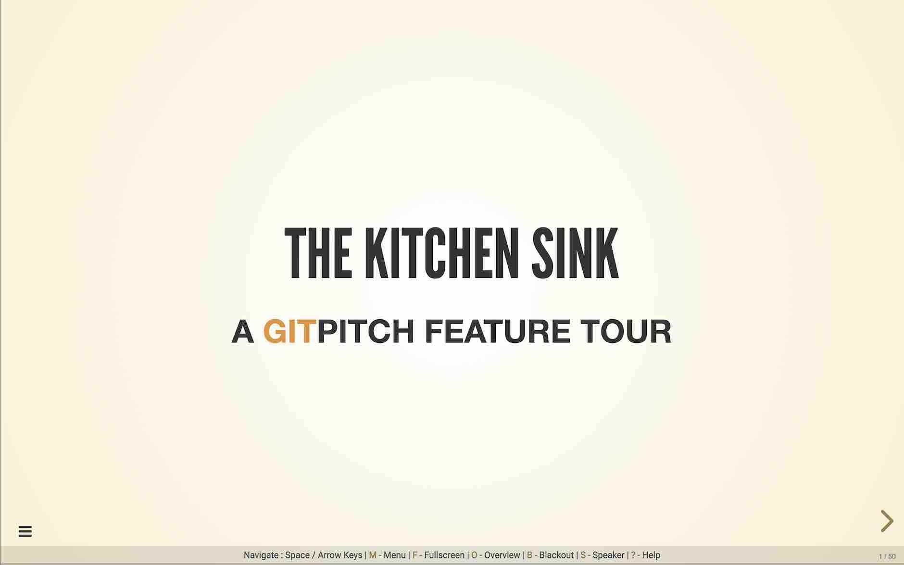
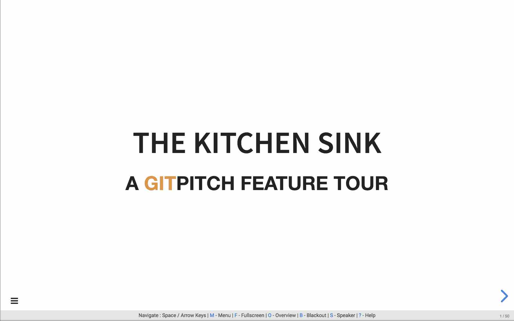
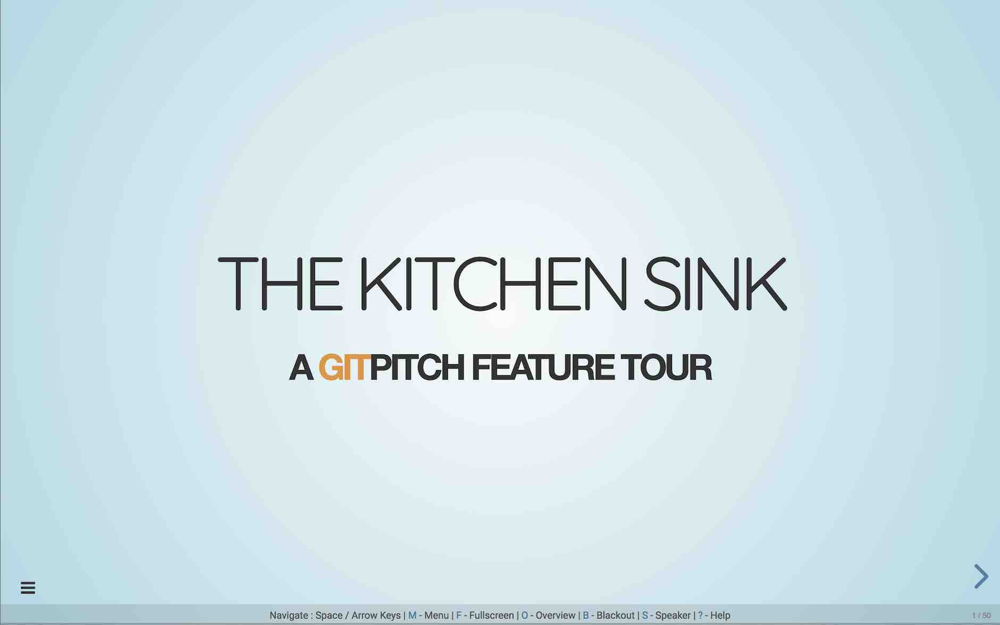
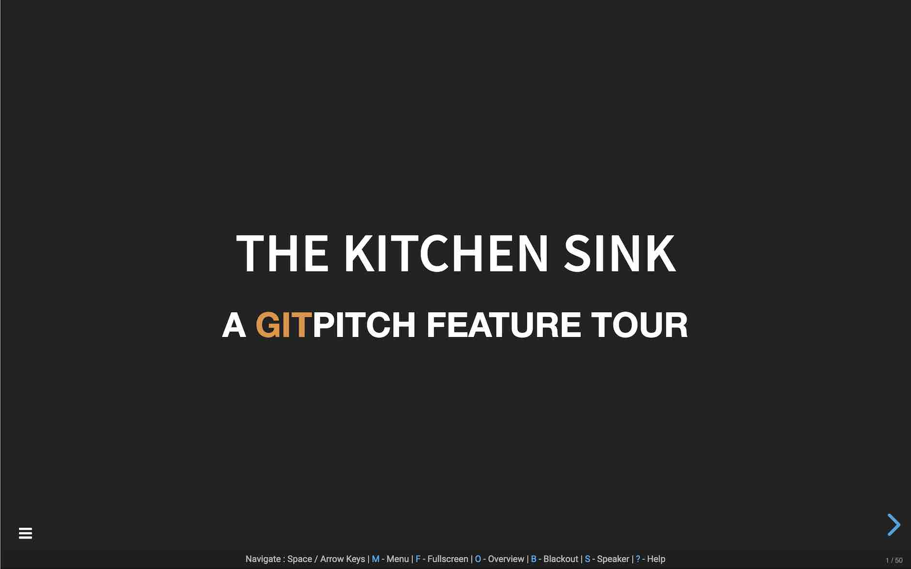
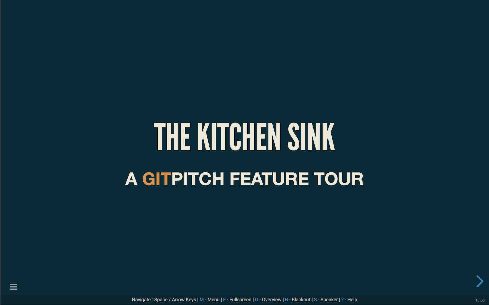
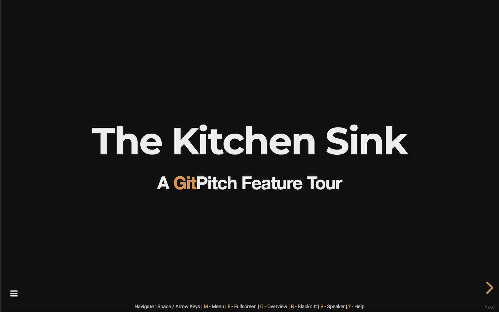
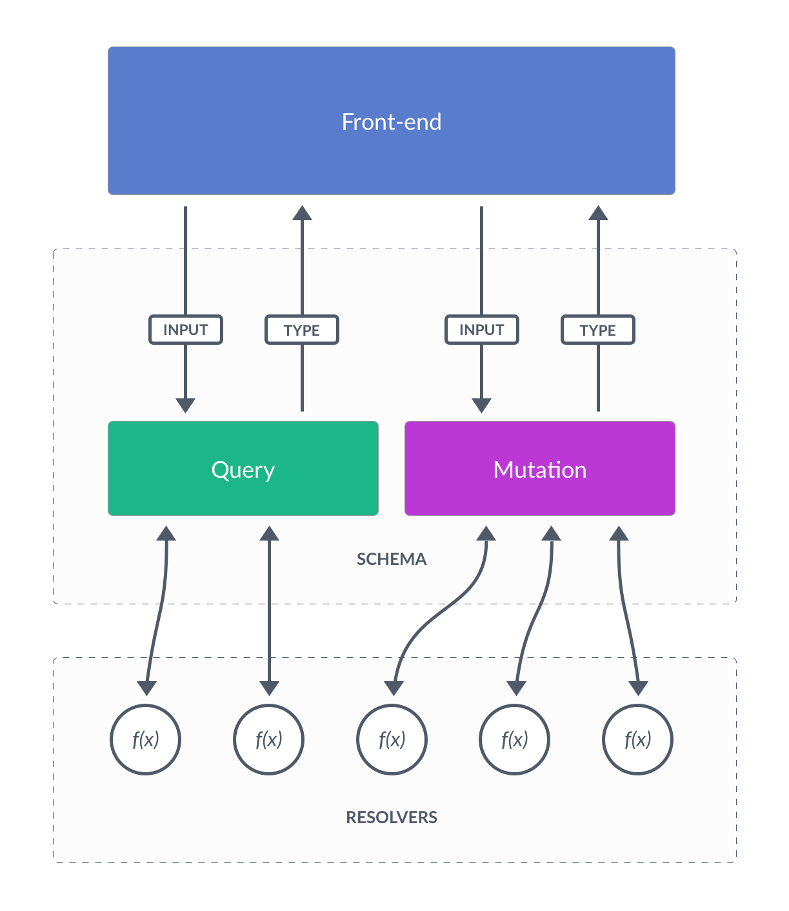
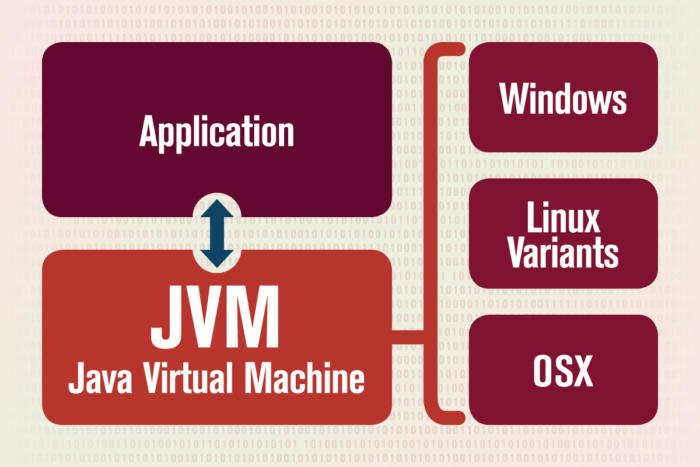

---?image=assets/img/kitchen-sink.jpg
@title[Introduction]

@snap[north headline]
@css[heading](The Kitchen Sink)
@snapend

@snap[south byline]
A @color[#e49436](Git)Pitch Feature Tour
@snapend

---
@title[Theme Switcher]

### Slideshow Theme Switcher
@css[help](@fa[arrow-left] The theme switcher is found inside the burger-menu.)

@snap[north-west thumbnail]

@snapend

@snap[north thumbnail-center]

@snapend

@snap[north-east thumbnail]

@snapend

@snap[south-west thumbnail]

@snapend

@snap[south thumbnail-center]

@snapend

@snap[south-east thumbnail]

@snapend

---?color=white
@title[Go Fullscreen]


<br><br>
For the *best viewing experience*<br>press the **F** key to go fullscreen.

---

## Markdown Slides
@css[tip](Press the Space or Down key for more details.)

@fa[arrow-down]

@snap[south doclink]
See the [GitPitch Markdown Docs](https://gitpitch.com/docs/markdown-features) for further details.
@snapend

+++
@title[GFM]

#### Use GitHub Flavored Markdown
#### For Slide Content Creation

<br>

The *same syntax* you use to create project   
**READMEs** and **Wikis** for your Git repos.

---
@title[Inline Images]

## Image Slides
## [ Inline ]
@css[tip](Press the Space or Down key for a live demo.)

@fa[arrow-down]

@snap[south doclink]
See the [GitPitch Inline Image Docs](https://gitpitch.com/docs/image-features/inline) for further details.
@snapend

+++
@title[Visual Statement]

#### Make A Visual Statement

<br>

Add *visual punch* to any slide<br>using inline images to tell your story.

+++
@title[Relative URLs]

@css[tip](Inline Image at Git Repo <b>Relative URL</b>)
<br>

<br>
@css[help](the <b>Octocat-De-Los-Muertos</b> by [cameronmcefee](https://github.com/cameronmcefee))

+++
@title[Absolute URLs]

@snap[west splitscreen]
@css[tip](Inline Image at <b>Absolute URL</b>)
<br>

<br>
@css[help](the <b>Private Investocat</b> by [jeejkang](https://github.com/jeejkang))
@snapend

@snap[east splitscreen fragment]
@css[tip](<b>Animated GIFs</b> Work Too!)
<br>

<br>
@css[help](the <b>Daftpunktocat-Guy</b> by [jeejkang](https://github.com/jeejkang))
@snapend

---
@title[Background Images]

## Image Slides
## [ Background ]

@css[tip](Press the Space or Down key for a live demo.)

@fa[arrow-down]

@snap[south doclink]
See the [GitPitch Background Image Docs](https://gitpitch.com/docs/image-features/background) for further details.
@snapend

+++
@title[Bold Statements]

#### Make A Bold Visual Statement

<br>

Use *size-optimized* background images<br>for *best Web viewing experience*.

+++?image=assets/img/robot.jpg
@title[Future Human]

+++?image=assets/img/127.jpg
@title[127.0.0.1]

+++?image=assets/img/supercar.jpg&opacity=40
@title[Aesthetics]

@snap[north-west]
@size[2.5em](Beautiful?)
@snapend

@snap[south aesthetics]
It all comes down to the observer and aesthetics.
@snapend

---

## Code Presenting
## Repo Source Files
@css[tip](Press the Space or Down key for a live demo.)

@fa[arrow-down]

@snap[south doclink]
See the [GitPitch Code Presenting Docs](https://gitpitch.com/docs/code-features) for further details.
@snapend

+++?code=src/go/server.go&lang=golang&title=Source: Golang File

@[1,3-6](Present code found within any repo source file.)
@[8-18](Without ever leaving your slideshow.)
@[19-28](Using GitPitch code-presenting with (optional) annotations.)

---
@title[Present Static Block]

## Code Presenting
## Static Source Blocks
@css[tip](Press the Space or Down key for a live demo.)

@fa[arrow-down]

@snap[south doclink]
See the [GitPitch Code Presenting Docs](https://gitpitch.com/docs/code-features) for further details.
@snapend

+++
@css[menu-title slide-title](Source: JavaScript Block)

```javascript
// Include http module.
var http = require("http");

// Create the server. Function passed as parameter
// is called on every request made.
http.createServer(function (request, response) {
  // Attach listener on end event.  This event is
  // called when client sent, awaiting response.
  request.on("end", function () {
    // Write headers to the response.
    // HTTP 200 status, Content-Type text/plain.
    response.writeHead(200, {
      'Content-Type': 'text/plain'
    });
    // Send data and end response.
    response.end('Hello HTTP!');
  });

// Listen on the 8080 port.
}).listen(8080);
```

@[1,2](You can present code inlined within your slide markdown too.)
@[9-17](Displayed using code-syntax highlighting just like your IDE.)
@[19-20](Again, all of this without ever leaving your slideshow.)

---
@title[Present GIST]

## Code Presenting
## GitHub GIST
@css[tip](Press the Space or Down key for a live demo.)

@fa[arrow-down]

@snap[south doclink]
See the [GitPitch Code Presenting Docs](https://gitpitch.com/docs/code-features) for further details.
@snapend

+++?gist=onetapbeyond/494e0fecaf0d6a2aa2acadfb8eb9d6e8&lang=Scala&title=Source: Scala GIST

@[23](You can even present code found within any GitHub GIST.)
@[41-53](GIST source code is beautifully rendered on any slide.)
@[57-62](Code-presenting works seamlessly both online and offline.)

---
@title[Snap Layouts]

## Snap Layouts
@css[tip](Press the Space or Down key for a live demo.)

@fa[arrow-down]

@snap[south doclink]
See the [GitPitch Snap Layouts Docs](https://gitpitch.com/docs/layout-features) for further details.
@snapend

+++
@title[Custom Placement]

#### Use Snap Layouts For Custom Placement<br>Of Slide Content On Any Slide

<br>

You can override the automatic slide layout<br>to bring your most creative ideas to life.

+++?color=#E6E8EC
@title[Snap Layout Demo]

@snap[north-west]
@size[1.5em](GraphQL)
@snapend

@snap[west graphql-details]
GraphQL is a query language for APIs and a runtime for fulfilling those queries with your existing data. GraphQL provides a complete and understandable description of the data in your API, gives clients the power to ask for exactly what they need and nothing more, makes it easier to evolve APIs over time, and enables powerful developer tools.
@snapend

@snap[east graphql-arch]

@snapend

+++?color=#E6E8EC
@title[Snap Layout Demo]

@snap[north-east graphql-title]
@size[1.5em](GraphQL)
@snapend

@snap[east graphql-bullets]
@ul[](false)
- Query is a read-only operation
- Mutation is a read-write operation
- Resolver provides a mapping between a portion of a GraphQL operation and a backend handler
- Schema defines what queries and mutations can be performed
- Type defines the shape of response data that can be returned
@ulend
@snapend

@snap[west graphql-arch]

@snapend

---

## Markdown Fragments
@css[tip](Press the Space or Down key for a live demo.)

@fa[arrow-down]

@snap[south doclink]
See the [GitPitch Markdown Fragments Docs](https://gitpitch.com/docs/markdown-features/fragments) for further details.
@snapend

+++

#### Reveal Slide Concepts Piecemeal
@title[Fragment Concepts]

<br>

Step through slide content in sequence   
to *slowly reveal* the bigger picture.

+++
@title[Mixed Content Fragments]

@snap[north-west]
JVM Polyglot Runtime
@snapend

@snap[west]
<br>
@ul
- Java
- Groovy
- Kotlin
- Scala
- Clojure
@ulend
@snapend

@snap[east jvmarch fragment]

@snapend

+++
@title[Table Content Fragments]


@snap[north]
Table Data Fragments
@snapend

<table>
  <tr>
    <th>Firstname</th>
    <th>Lastname</th>
    <th>Age</th>
  </tr>
  <tr>
    <td>Jill</td>
    <td>Smith</td>
    <td>25</td>
  </tr>
  <tr class="fragment">
    <td>Eve</td>
    <td>Jackson</td>
    <td>94</td>
  </tr>
  <tr class="fragment">
    <td>John</td>
    <td>Doe</td>
    <td>43</td>
  </tr>
</table>

---

## Math Formulas Slides
@css[tip](Press the Space or Down key for a live demo.)

@fa[arrow-down]

@snap[south doclink]
See the [GitPitch Math Formulas Docs](https://gitpitch.com/docs/rich-media-features/math-formulas) for further details.
@snapend

+++
@title[Beautiful Math]

#### Beautiful Math Rendered Beautifully

<br>

Use *TeX*, *LaTeX* and *MathML* markup   
powered by [MathJax](https://www.mathjax.org).

+++
@title[Sample]

`$$\sum_{i=0}^n i^2 = \frac{(n^2+n)(2n+1)}{6}$$`

+++
@title[Sample]

`\begin{align}
\dot{x} & = \sigma(y-x) \\
\dot{y} & = \rho x - y - xz \\
\dot{z} & = -\beta z + xy
\end{align}`

+++
@title[Sample]

##### The Cauchy-Schwarz Inequality

`\[
\left( \sum_{k=1}^n a_k b_k \right)^{\!\!2} \leq
 \left( \sum_{k=1}^n a_k^2 \right) \left( \sum_{k=1}^n b_k^2 \right)
\]`

+++
@title[Inline Sample]

##### In-line Mathematics

This expression `\(\sqrt{3x-1}+(1+x)^2\)` is an example of an inline equation.

---

## Chart Slides
@css[tip](Press the Space or Down key for a live demo.)

@fa[arrow-down]

@snap[south doclink]
See the [GitPitch Charts Docs](https://gitpitch.com/docs/rich-media-features/charts) for further details.
@snapend

+++
@title[Chart Types]

#### Chart Data Rendered Beautifully

<br>

Use *Bar*, *Line*, *Area*, and *Scatter* charts among many other chart types directly within your markdown, all powered by [Chart.js](http://www.chartjs.org).

+++
@title[Sample Line Chart]

<canvas data-chart="line">
<!--
{
 "data": {
  "labels": ["January"," February"," March"," April"," May"," June"," July"],
  "datasets": [
   {
    "data":[65,59,80,81,56,55,40],
    "label":"My first dataset","backgroundColor":"rgba(20,220,220,.8)"
   },
   {
    "data":[28,48,40,19,86,27,90],
    "label":"My second dataset","backgroundColor":"rgba(220,120,120,.8)"
   }
  ]
 },
 "options": { "responsive": "true" }
}
-->
</canvas>

+++
@title[Sample Bar Chart]

<canvas class="stretch" data-chart="horizontalBar">
<!--
{
 "data" : {
  "labels" : ["Grapefruit", "Orange", "Kiwi",
    "Blackberry", "Banana",
    "Blueberry"],
  "datasets" : [{
    "data": [48, 26, 59, 39, 21, 74],
    "backgroundColor": "#e49436",
    "borderColor": "#e49436"
  }]
  },
  "options": {
    "title": {
      "display": true,
      "text": "The most delicious fruit?",
      "fontColor": "gray",
      "fontSize": 20
    },
    "legend": {
      "display": false
    },
    "scales": {
      "xAxes": [{
        "ticks": {
            "beginAtZero": true,
            "max": 80,
            "stepSize": 10,
            "fontColor": "gray"
        },
        "scaleLabel": {
          "display": true,
          "labelString": "Respondents",
          "fontColor": "gray"
        }
      }],
      "yAxes": [{
        "ticks": {
            "fontColor": "gray"
        }
      }]
    }
  }
}
-->
</canvas>

---
@title[Embed Video]
## Video Slides
## [ Inline ]
@css[tip](Press the Space or Down key for a live demo.)

@fa[arrow-down]

@snap[south doclink]
See the [GitPitch Inline Video Docs](https://gitpitch.com/docs/rich-media-features/inline-videos) for further details.
@snapend

+++
@title[YouTube, etc]

#### Bring Your Presentations Alive

<br>

Embed *YouTube*, *Vimeo*, *MP4* and *WebM*   
inline on any slide.

+++
@title[Fresh Guacamole]


+++
@title[Gravity]


+++
@title[Big Buck Bunny]


---
@title[Background Videos]

## Video Slides
## [ Background ]
@css[tip](Press the Space or Down key for a live demo.)

@fa[arrow-down]

@snap[south doclink]
See the [GitPitch Background Video Docs](https://gitpitch.com/docs/rich-media-features/background-videos) for further details.
@snapend

+++
@title[Viewer Experience]

#### Maximize The Viewer Experience

<br>

Go fullscreen with *MP4* and *WebM* videos.

+++?video=http://clips.vorwaerts-gmbh.de/big_buck_bunny.mp4
@title[Big Buck Bunny]

---
## @css[notransform](PITCHME.yaml) Settings
@css[tip](Press the Space or Down key for more details.)

@fa[arrow-down]

@snap[south doclink]
See the [GitPitch Settings Docs](https://gitpitch.com/docs/settings) for further details.
@snapend

+++?image=assets/img/brand.jpg
@title[Custom Look and Feel]

@snap[north brand]
Stamp Your Own Brand On Any Slideshow
<br><br>
@css[brand-options](Use settings to activate a fixed slideshow theme, set a custom logo, custom layout, custom css, default background image, even your preferred code highlighting style and more.)
@snapend

---
@title[Keyboard Controls]
## Slideshow Keyboard Controls
@css[tip](Press the Space or Down key for more details.)

@fa[arrow-down]

@snap[south doclink]
See the [GitPitch Keyboard Controls Docs](https://gitpitch.com/docs/foundation-features/keyboard-controls) for further details.
@snapend

+++
@title[Try Out Now!]

#### Try Out These Keyboard Controls Now!

<br>

| Mode | On Key | Off Key |
| ---- | :------: | :--------: |
| Fullscreen | F |  Esc |
| Overview | O |  O |
| Blackout | B |  B |
| Speaker View | S |  - |
| Help | ? |  Esc |


---
@title[Get The Word Out!]

@snap[south help docslink]
For more details, examples, tips, and tricks see the [GitPitch Docs](https://gitpitch.com/docs)
@snapend

## GO FOR IT.
## JUST ADD @color[#e49436](@css[notransform](PITCHME.md)) ;)

